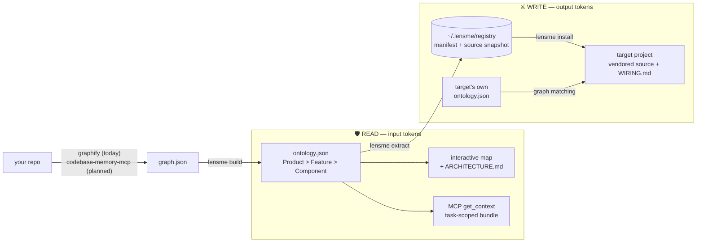

# lensme

**Cut agent token costs on both axes: read less, write less.**
A C4-style ontology layer over your code graph — humans get an always-fresh
architecture map, agents get task-scoped context instead of raw source, and
commodity code gets assembled from verified components instead of regenerated.


*[FastAPI](https://github.com/fastapi/fastapi) (2,718 files) mapped with zero
config: source features first, docs/examples/tests sidelined into supporting
bands, real externals (starlette, pydantic) from `pyproject.toml`.
[Demo GIF](docs/assets/demo-fastapi.gif) shows the detail panel and
change-impact analysis.*

## The thesis: token cost has two axes, and they're symmetric

Every AI coding session pays twice. It pays **input tokens** to understand the
codebase (exploration: `ls`, `grep`, reading files that turn out to be wrong),
and it pays **output tokens** to produce code (regenerating the same auth /
CRUD / upload / TTS commodity logic the world has written a thousand times).
lensme attacks both with the same artifact — the ontology:

### 🛡️ READ — input token savings (ontology + `get_context`)

Instead of feeding an agent tens of thousands of lines to orient itself, one
MCP call returns a task-scoped bundle: the owning component, files ranked by
relevance with symbols, read-first suggestions, dependencies, and blast
radius — trimmed to a token budget. The agent reads the *map*, then reads
exactly one file.

> Measured on FastAPI: exploration tokens **29–99% lower** than an
> ls + grep + read-candidates walk, task-dependent ([details below](#benchmarks-honestly)).

### ⚔️ WRITE — output token savings (component assembly)

Instead of typing a battle-tested module back into existence, the agent
searches a local registry of components extracted from repos you own, vendors
the source shadcn-style (copy it, own it — no package dependency), and writes
only the glue. The implementation never enters the context window; the agent
reads a `manifest.json` and a computed wiring plan.

> Measured on 3 real production components: **91% fewer tokens** than
> regenerating them (9,789 → 915, and the regeneration side is a lower
> bound — [details below](#component-assembly-in-practice)).

The symmetry is the product: one ontology drives the human map, the agent's
reading, and the agent's writing.

## How it flows



Both ends of the WRITE axis are ontologies — the component knows what shape of
dependency it expects (recorded at extract time), and the target project's
ontology says what's available. Wiring is graph matching, not guesswork.

## Quick start

```bash
# once: install (from this repo)
uv tool install --editable ./lensme
(cd lensme/ui && npm install && npm run build)

# one command: extract (graphify) + build ontology + open the map
lensme scan .
```

Or step by step: `graphify .` then `lensme build --name myproject` then
`lensme serve`.

`lensme serve --watch` keeps the map fresh: when graphify rewrites
`graph.json` (its `--watch` mode or commit hook), the ontology is rebuilt
automatically and the browser picks it up within seconds.

## Component assembly in practice

The walkthrough below is the real flow we validated, extracting production
assets from a shorts-generation backend (multi-provider TTS, image
generation, job store).

**1. Extract** — in the source repo, after `lensme build`:

```bash
$ lensme extract "Text-to-Speech"
extracted text-to-speech@1.0.0 (3 files, 19 exports, 0 bundled tests)
```

If the source tree is flat and the heuristics can't find components, lensme
says so (`meta.enrichment_recommended`) and an agent classifies the files
from symbol digests — that's how the 17-file flat package above became 9
meaningful components before extraction.

**2. Search** — in any other project:

```bash
$ lensme registry search "tts narration"
text-to-speech@1.0.0 (typescript, EXTRACTED)
  Multi-provider TTS: narration text/SSML building, provider fallback chain, ...
  exports: buildWavFile(), extractPcmFromTtsResponse(), pcmDurationMs(), ...
```

**3. Install** — vendor + computed wiring plan:

```bash
$ lensme install text-to-speech . --target-ontology graphify-out/ontology.json
installed 3 files
wiring plan: text-to-speech/WIRING.md
  done when: component imports resolve and the target project's own checks pass
```

`WIRING.md` is not a static template — it's computed by matching the
component's unresolved boundary against the *target project's* ontology:

- each unresolved dependency gets a status — `auto_matched` (single
  high-confidence equivalent found in your project), `needs_decision`
  (candidates listed), or `missing` (create one; the original's shape —
  provider file, symbols, import statements — is included as the spec)
- config keys are checked against your `.env` (`present` / `add_required`)
- external deps are checked against your `pyproject.toml` / `package.json`
- it ends with an explicit **definition of done**, so an agent doing the
  wiring knows when to stop

Verification is provenance, not marketing: each component records its source
repo + commit (`EXTRACTED`) and carries its bundled tests when the ontology
links any.

**Measured** (`python examples/bench_assembly.py`, chars/4 estimate):

| component | regenerate (emit tokens) | assemble (context tokens) | saved |
|---|---|---|---|
| text-to-speech (3 providers) | 5,746 | 365 | 94% |
| image-generation | 2,835 | 308 | 89% |
| job-store | 1,208 | 242 | 80% |

The regeneration side is a lower bound (exploration and bug-iteration cost
excluded), and glue code is excluded from both sides. The honest scope
boundary: assembly wins on the commodity layer; project-unique business
logic still gets generated.

## Try it with your agent

Register the MCP server (restart your agent session after):

```bash
claude mcp add lensme -- lensme mcp --ontology /abs/path/graphify-out/ontology.json
```

Ten tools come up: `get_context`, `overview`, `search`, `component`,
`impact`, `path`, `explain` (READ axis) and `search_components`,
`get_component`, `install_component` (WRITE axis).

Then run the experiment: in a fresh project, ask for something your registry
covers — e.g. *"add a shorts narration feature"* — and watch the chain:

1. the agent calls `search_components("tts narration")` and gets metadata
   only (a few hundred tokens, never the implementation),
2. calls `install_component` with your project root and ontology,
3. opens `WIRING.md`, wires the `auto_matched` items, asks you about
   `needs_decision` ones, creates `missing` ones from the recorded shape,
4. writes glue code only, and stops at the definition of done.

If it starts generating a TTS client from scratch instead, that's your
signal to check the registry search terms — the tool descriptions tell
agents to search before generating commodity code, but the component's name
and description are what make it findable.

## Commands

| command | what it does |
|---|---|
| `lensme scan [path]` | one command: graphify extract + build + serve |
| `lensme extract "Component"` | package an ontology component into `~/.lensme/registry` |
| `lensme registry list\|search\|show` | browse/search the local component registry |
| `lensme install <name> [dest] [--target-ontology o.json]` | vendor a component + computed wiring plan |
| `lensme report [-o ARCHITECTURE.md]` | living architecture doc: structure, relationships, externals, blast radius, hotspots |
| `lensme path A B` | shortest relationship path between two nodes (component or file level) |
| `lensme explain X` | everything known about one node: symbols, owner chain, edges |
| `lensme merge a.json b.json --name org` | System-level view across repos, with shared externals |
| `lensme build --prefix p/ --name x [--enrichment e.json] [--tree]` | graph.json → ontology.json; saves config for `sync` |
| `lensme sync [--watch]` | rebuild using the saved config (optionally on graph change) |
| `lensme serve [--watch] [--port N]` | serve UI + ontology.json (+ graph.html, hotspots.json), open browser |
| `lensme symbols --prefix p/ [--changed]` | per-file symbol digest for agent enrichment (hash-cached) |
| `lensme tree ontology.json` | pretty-print an ontology |
| `lensme mcp [--ontology o.json]` | MCP server (stdio, zero-dep): the ten tools above |
| `lensme impact-check [--repo r] [--files ...]` | blast radius of staged files - informational, never blocks; `--install-hook` writes a pre-commit hook |
| `lensme hotspots [--repo r] [--since "6 months ago"]` | git churn + co-change joined onto the ontology; flags co-changed pairs with **no** structural edge (hidden coupling) |
| `lensme diff old.json new.json [--json]` | structural diff: the engine for PR architecture reports |

## Git integration

```bash
# pre-commit: see the blast radius before you commit (never blocks)
lensme impact-check --install-hook --repo . --ontology graphify-out/ontology.json

# architecture time machine: churn heatmap + hidden coupling
lensme hotspots --repo . && lensme serve   # then toggle "Show Hotspots"

# PR report core: diff two builds
lensme diff main-ontology.json feature-ontology.json
```

## Design

Two stages, mirroring graphify's own extraction philosophy:

1. **Deterministic skeleton** - no API key, no LLM. Directory nesting, path-token
   domain discovery, package-manifest externals, import-statement scanning.
   Works well for domain-nested codebases (`src/components/billing/...`).
2. **Agent enrichment (optional)** - for flat packages where directories carry no
   signal, a host agent (e.g. Claude running this tool) classifies files into
   components from their symbol digests. See `docs/enrichment-spec.md`.
   No separate API key needed when run inside an agent session.

Every node carries an honest confidence tag - surfaced in the UI's
Properties tab:

- `EXTRACTED` - structural fact from the graph (files, imports, calls)
- `INFERRED-heuristic` - path/naming rule
- `INFERRED-llm` - agent classification (with rationale)

**Backends**: lensme consumes a code graph, it doesn't build one. Today that
graph comes from [graphify](https://github.com/Graphify-Labs/graphify); an
adapter for [codebase-memory-mcp](https://github.com/DeusData/codebase-memory-mcp)
(LSP-refined call edges, cross-service links) is planned — its schema has
been validated against the lensme contract. The contact surface is six
fields, deliberately small, so the graph engine is replaceable.

## Output schema (`ontology.json`, schema_version 2)

```jsonc
{
  "schema_version": 2,
  "meta": { "built_at", "source_graph", "graph_stats", "level_counts" },
  "type": "Product", "name": "...", "description": "...", "stats": {...},
  "children": [ /* Feature > Component > Module > File, each with
                   confidence, rationale, description, responsibilities, stats;
                   File nodes carry symbols: [{name, line}] */ ],
  "component_relationships": [   // rolled up from file-level graph edges
    { "source", "target", "relation": "depends_on|calls|references|implements|integrates_with",
      "confidence": "EXTRACTED", "count": 3 } ],
  "file_relationships": [...],   // v2: the same edges before component rollup
  "external": [...],             // from package manifests
  "database": [...],             // keyword-detected data stores
  "impact": { "<component_id>": { "direct": [...], "indirect": [...], "total_files": N } }
}
```

## Benchmarks, honestly

### READ axis: exploration tokens

Measured on FastAPI across 5 tasks, baseline = ls + grep + read the top-3 grep
candidates, lensme = one `get_context` call + read the suggested file
(`python examples/bench_context.py <repo> <ontology.json> "<task>"`,
chars/4 token estimate - directional, not tokenizer-exact):

| task | baseline tokens | lensme tokens | reduction |
|---|---|---|---|
| oauth2 security scopes | 48,961 | 8,008 | 84% |
| dependency injection | 31,635 | 11,880 | 62% |
| websocket support | 91,693 | 65,139 | 29% |
| background tasks | 27,244 | 2,132 | 92% |
| response model validation | 571,901 | 5,893 | 99% |

**Reduction ranges 29-99%, not a fixed multiplier**, and the two ends explain
why: the 99% case has a baseline that explodes because "response"/"model" are
common words that grep-hit deep into the docs corpus, not because lensme did
anything special. The 29% case is the honest floor - `routing.py` (the
correct answer) is itself a 63k-token file, so once found, its content
dominates both strategies' totals and exploration savings barely move the
needle. Either way `get_context` also returns the blast radius, which the
baseline walk never computes. Small sample (5 tasks, 1 repo, one author for
both the tool and the benchmark) - `examples/bench_context.py` is the whole
methodology, run it on your own repo rather than trusting a single number.

### READ axis: does it point at the right file?

Token savings are cheap to claim and meaningless if `get_context` points at
the wrong file. `examples/bench_accuracy.py` checks that directly, against
ground truth mined from git history (not hand-picked): single/double-file
commits under `fastapi/` become (commit message -> actually-changed file)
pairs, gitmoji/PR-number stripped, 108 pairs from FastAPI's real history.

| metric | result |
|---|---|
| `read_first[0]` is the file the commit changed | 26% (28/108) |
| changed file is in `read_first` (top 3) | 46% (50/108) |
| changed file is anywhere in the returned file list | 81% (88/108) |

This benchmark caught two real bugs, both fixed in the current build (not
adjusted after the fact - see git history): a `"scripts"` directory was
mis-classified as product source, so its 64 dev-tooling files out-voted the
9-50 file components that were the actual answer on pure volume; and
task-word matching used raw substring instead of tokenized comparison, so
the word "fix" in a task false-matched `fixer.py`. Fixing both moved the
"anywhere" hit rate from 30% to 81%.

The remaining misses are a real ceiling of keyword matching, not a further
bug: tasks like "Add support for PEP695 `TypeAliasType`" name a concept that
appears nowhere in the target file's path or symbol names - `get_context`
can't find what isn't lexically there. This is exactly what
`meta.enrichment_recommended` and agent enrichment exist for.

**Not comparable to codebase-memory-mcp's reported 83% answer quality** - different
metric (file localization vs. Q&A correctness), different ground truth
methodology, one repo vs. their 31. Their [preprint](https://arxiv.org/abs/2603.27277)
is worth reading for how a rigorous version of this benchmark looks.

### WRITE axis: assembly vs regeneration

See [Component assembly in practice](#component-assembly-in-practice) — 91%
total across three real components, with the lower-bound caveat stated.

## Validated against external repos

Run on [FastAPI](https://github.com/fastapi/fastapi) (2,718 files, ~74% of
which are docs/translations - a worst case for path heuristics):

- `tests/`, `docs/`, `docs_src/`, `scripts/` are classified as supporting
  bands and sorted after the product source instead of drowning it (before
  this, "Docs" was the top feature with 2,016 files).
- Externals are read from `pyproject.toml` / `requirements.txt`, not just
  `package.json`: starlette, pydantic, typing-extensions detected with
  `integrates_with` edge counts per component.
- Flat packages (no directory signal) set `meta.enrichment_recommended` and the
  CLI prints a hint, instead of inventing features from filename tokens.

The FastAPI failure modes are pinned as regression tests in
`tests/test_build.py` (`test_support_kinds_sidelined`,
`test_python_manifest_externals`, `test_flat_package_flag`,
`test_scripts_dir_is_tooling_not_source`).

## Development

```bash
for f in tests/test_*.py; do python $f; done   # 35 self-checks, no test deps
cd ui && npm run dev                           # UI dev server (proxies /ontology.json to :4173)
cd ui && npm run build                         # typecheck + production build
```
